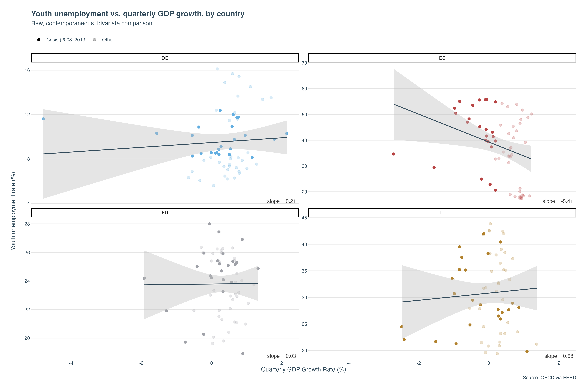

# Employment Protection and the Cyclical Sensitivity of Youth Unemployment: Spain vs. the Core

Does strict employment protection amplify youth unemployment during downturns? An econometric analysis of labor market duality across four Eurozone economies (ES, DE, FR, IT), grounded in comparative regional fieldwork in Spain.

 -->

*The graph above depicts the raw, bivariate, contemporaneous association between youth unemployment level and QoQ real GDP growth rate for Germany, Spain, Italy, and France during 2005-2019. The slopes for the observed countries differ greatly. Spain’s slope is negative and steep. Germany and France’s slopes are nearly flat. And Italy’s slope is positive and shallow, serving as the clearest symptom of the marked flow-level dynamic that muddles the association between the independent and dependent variables beyond what the presence of confounding variables already contributes. That being said, the differences in slopes motivates my hypothesis that country-specific labor protection regulation strictness amplifies increases in youth unemployment levels during periods of negative growth. Indeed, this theorized amplification effect,  represented in the coefficient β₁, is what my regression model seeks to confirm or deny.*

## Project Structure

* `data-raw/`: Immutable source data (FRED, OECD EPL indices).
* `data-clean/`: Standardized, mixed-frequency joined panels (long format; see Reproducibility).
* `scripts/`: Modular R processing, visualization, and regression pipelines.
* `outputs/`: Publication-grade dashboards and visual assets.
* `docs/`: Qualitative field observations and policy brief drafts.

## Methodological Overview

* **Data Horizon:** Q1 2005 to Q4 2019 (constrained by treatment data vintage, with the side benefit of excluding the pandemic structural break).
* **Econometric Framework:** Two-way fixed effects (country and quarter) panel regression to absorb time-invariant institutional confounding and common Eurozone shocks.
* **Statistical Correction:** Country-level clustered standard errors to address serial correlation, with a wild-cluster bootstrap as a robustness check given the small number of clusters (N=4).

### Causal Identification Strategy (DAG Framework)

To identify whether labor market stringency amplifies the transmission of cyclical shocks to youth unemployment, the model maps the causal system via a Directed Acyclic Graph (DAG) with the following parameters:

* **Exposure (D):** OECD Employment Protection Legislation (EPL) Strictness Indices — regular and temporary contracts (annual indices asymmetrically broadcast to quarterly frequency).
* **Outcome (Y):** Harmonized Youth Unemployment Rate (quarterly).
* **Observed Cyclical Control/Shock Variable (X):** Real GDP Growth Rate — both a cyclical control and the shock variable whose transmission to youth unemployment is hypothesized to vary with EPL strictness (identifying variation: the 2008–2013 Eurozone crisis).
* **Unobserved Confounders (U):** Time-invariant country-specific structures (cultural norms, baseline safety nets), absorbed by country fixed effects. Time-varying country-specific unobservables (e.g., reform sentiment, education policy shifts) remain a limitation.
* **Reverse Causality (Y → D):** Crisis-era unemployment plausibly drives labor market reform (e.g., Spain's 2012 reform). This pathway is acknowledged in the DAG and partially addressed via a lagged-EPL robustness specification; it is not fully resolved.
* **Reverse Causality (Y → X):** Crisis-era youth unemployment plausibly decreases aggregate demand, leading to diminished GDP Growth. This pathway is acknowledged in the DAG and bounded by the argument that although youth disproportionately absorb the effects of recession (in terms of unemployment), they are a small share of total demand and output, positioning feedback from youth unemployment to GDP as second order; it is not fully resolved.
* **Intra-interaction Causality (D → X):** EPL index level plausibly affects total output growth because labor market regulation alters firms' decision-making and the reallocation of labor across different sectors. This pathway is acknowledged in the DAG.

### Structural Equation

The formal model is specified as:

$$Y_{it} = \beta_1 (D_{it} \times X_{it}) + \beta_2 X_{it} + \alpha_i + \gamma_t + \epsilon_{it}$$

Where $\alpha_i$ denotes country fixed effects (absorbing time-invariant unobservables $U$), and $\gamma_t$ denotes quarter fixed effects (absorbing common Eurozone shocks such as monetary policy and the 2008–2013 crisis). The coefficient of interest is $\beta_1$, which captures whether the transmission of GDP shocks to youth unemployment intensifies under stricter employment protection.

**Note on identification:** The level effect of $D$ is largely absorbed by $\alpha_i$ for countries with regular-contract EPL index variation, while for Germany, it is strictly not identified due to the lack of variation. Given the limited amount and, in one case, lack of within-country variation in regular-contract EPL, identification of $\beta_1$ relies on cross-country differences in EPL levels interacting with within-country cyclical variation — principally the 2008–2013 Eurozone crisis.

### Secondary Specification: Labor Market Duality

Spain's youth unemployment dynamics are widely attributed to its dual labor market: strict protection for permanent insiders alongside flexible temporary contracts on which young workers are concentrated, making temporary employment the margin of adjustment in downturns (Bentolila, Dolado & Jimeno). A secondary specification therefore uses the regular–temporary EPL gap as the treatment:

$$\text{EPL}_{\text{gap}} = \text{EPL}^{regular}_{it} - \text{EPL}^{temporary}_{it}$$

estimated under the same two-way fixed effects interaction design. The temporary-contract series exhibits substantially more within-country reform variation than the regular-contract series (notably Italy and Spain), making this specification a meaningful test of whether duality — rather than regular-contract strictness per se — drives the amplification effect.

## Limitations

* **Small number of clusters (N=4):** Country-level clustered standard errors are asymptotically unreliable with four clusters (Bertrand, Duflo & Mullainathan, 2004). Inference is supplemented with a wild-cluster bootstrap as a robustness check.
* **Sticky treatment variable:** The regular-contract EPL index exhibits minimal within-country variation over the sample period. The interaction specification addresses this directly: the moderating effect is identified even where the level effect is not, and the duality specification draws on the richer within-country variation of the temporary-contract series.
* **Reverse causality (Y → D):** Crisis-era youth unemployment plausibly motivates labor market reform. Acknowledged in the DAG and partially addressed via a lagged-EPL robustness specification; not fully resolved.
* **Reverse causality (Y → X):** Crisis-era youth unemployment plausibly decreases aggregate demand, thereby weakening total output. Acknowledged in DAG and bounded by the argument that youth are a small share of demand and output, positioning feedback from youth unemployment to GDP as second order; not fully resolved.
* **Intra-interaction causality (D → X):** While the effects of labor market regulation on immediate growth are plausibly negligible because firms' decisions and the reallocation of labor take time to manifest at the macroeconomic level, they influence long-term growth. For this reason, the lagged EPL robustness check, meant to account for youth unemployment level's influence on labor market reform, surfaces the effects of D on X. This means that the lagged specification value of $\beta_1$ will no longer isolate the possible feedback that the dependent variable imposes on EPL index, thereby requiring a more nuanced reading.
* **External validity:** The panel covers four economies within a single currency union. Findings characterize the Eurozone core and Spain specifically, and should not be extrapolated to flexible-exchange-rate or emerging labor markets.
* **Treatment scope (individual dismissals only):** The Version 1 regular-contracts indicator captures the cost of dismissing individual permanent workers but excludes collective-dismissal procedures — a relevant adjustment margin during recessions. The treatment is therefore best interpreted as the individual insider firing cost central to the duality mechanism, rather than the full regulatory burden of crisis-era workforce reductions.

## Reproducibility

Scripts are numbered and should be executed in order:

1. `scripts/01_data_ingestion.R` — API pulls (FRED) and OECD EPL import
2. `scripts/02_wrangling_join.R` — key harmonization, asymmetric left join, truncation at Q4 2019
3. `scripts/03_eda.R` — long-to-wide pivot, gap construction, panel validation
4. `scripts/04_visualization.R` — dashboard construction
5. `scripts/05_regression.R` — two-way FE estimation and robustness checks

**Data format note:** `data-clean/eurozone_macro_clean.csv` is stored in long format (one row per country-quarter-measure; 480 rows). Analysis scripts pivot to wide format (240 country-quarter observations) before constructing `epl_gap` and estimating any model.

**Data sources:**

* Youth Unemployment Rate (15–24, quarterly): FRED series IDS `LRUN24TTESQ156S`, `LRUN24TTDEQ156S`, `LRUN24TTFRQ156S`, `LRUN24TTITQ156S`
* Real GDP Growth Rate (quarterly): FRED series `CLVMNACSCAB1GQES`, `CLVMNACSCAB1GQDE`, `CLVMNACSCAB1GQFR`, `CLVMNACSCAB1GQIT`
* Employment Protection Legislation — individual dismissals, regular contracts (annual): OECD `EPR` indicator, version 1, through 2019 
* Employment Protection Legislation — temporary contracts (annual): OECD `EPT` indicator, version 1, through 2019
* Version 1 is used for both indicators as it is the only vintage providing consistent regular- and temporary- contract measures across the full sample period; Version3 begins in 2008 and would exclude the pre-crisis baseline.

**Environment:** R version and package versions are recorded in `sessionInfo.txt` at the root of this repository.

## Qualitative Component

This project is grounded in comparative fieldwork conducted across two structurally distinct Spanish regions in May–June 2026: Salamanca (inland Castile and León; services- and agriculture-oriented, documented via Chamber of Commerce engagement) and Gijón (coastal Asturias; maritime, industrial, and port-driven). The observed contrast in labor market composition and visible youth employment dynamics motivates this project's central hypothesis — that Spain's dual labor market transmits cyclical shocks to young workers with unusual force — and informs the interpretation of the country fixed effects. Full field notes: [`docs/field_observations.Rmd`](docs/field_observations.Rmd).